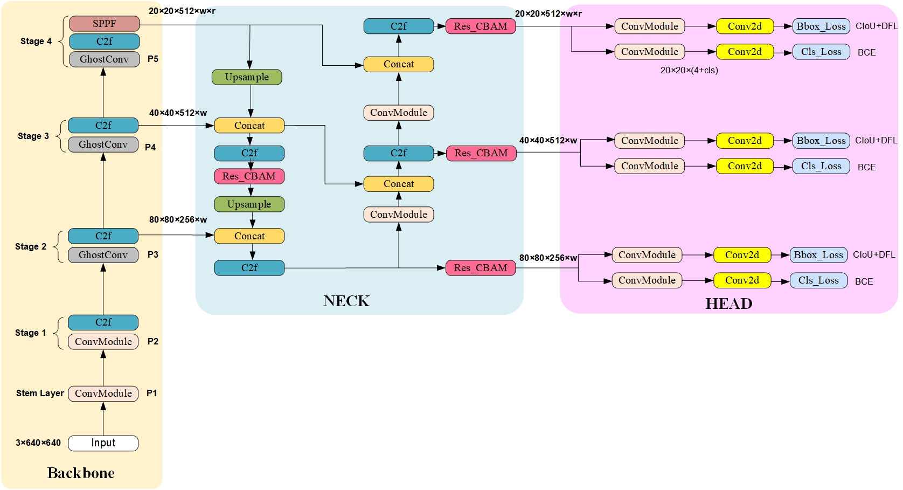

# Industrial defect auxiliary detection system based on improved YOLOv8 algorithm(基于改进YOLOv8算法的工业瑕疵辅助检测系统)
## Architecture

  

## Table 1: Comparisons with other detection models on the NEU-DET dataset models
| Model | Test Size | Param. | FLOPs |  mAP50val | mAP50-95val |
| :--: | :-: | :-: | :-: | :-: | :-: |
| YOLOv5s | 640 | 7.04M | 15.9G |  70.87% | 35.02%|
| YOLOv5m | 640 | 20.89M | 183.5G |  71.74% | 36.67%  |
| YOLOv5l | 640 | 46.17M | 183.5G |  72.23% | 36.74%  |
| YOLOv7 | 640 | 37.22M | 196.2G |  71.92% | 37.2% |
| YOLOv8 | 640 | 3.01M | 8.1G |  77.2% | 46.2%  |
| **Our model** | **640** | **4.05M** | **10.2G** | **79.2%** | **47%** |
