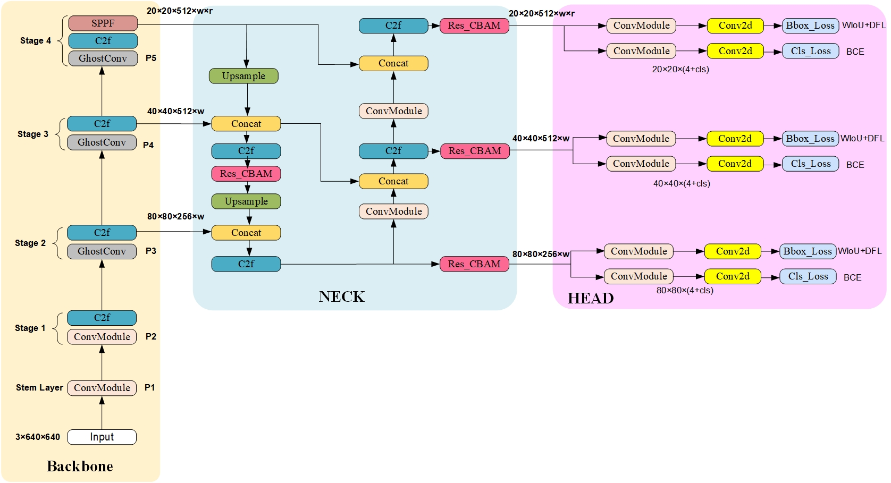
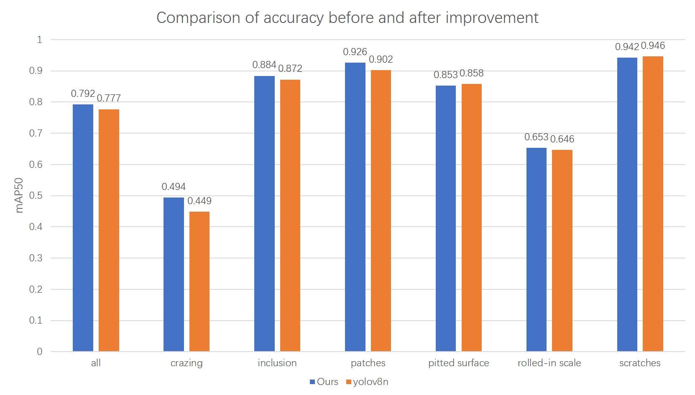
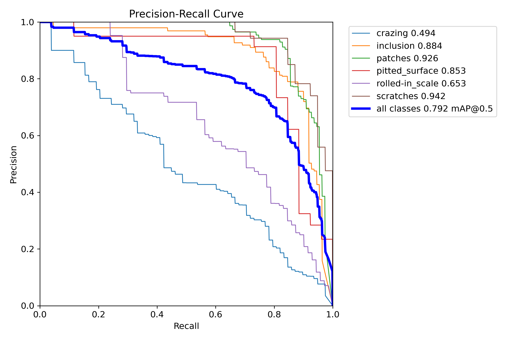
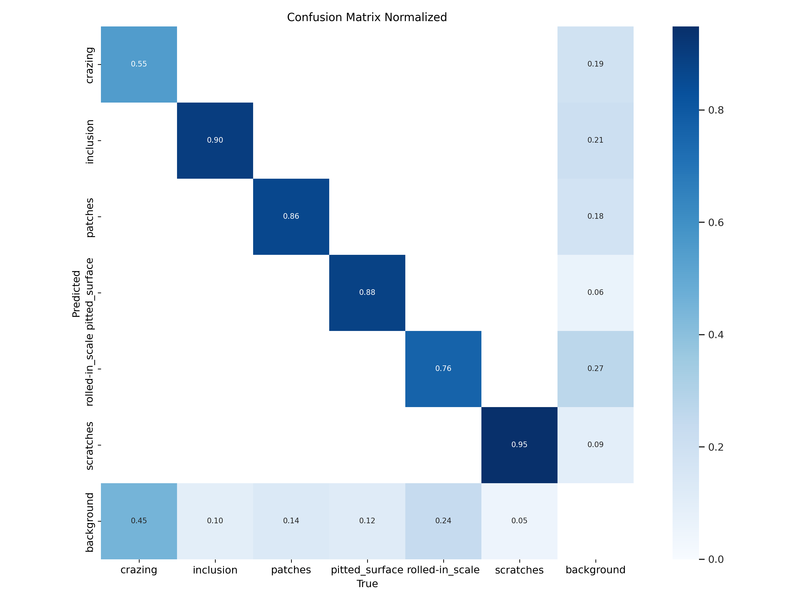
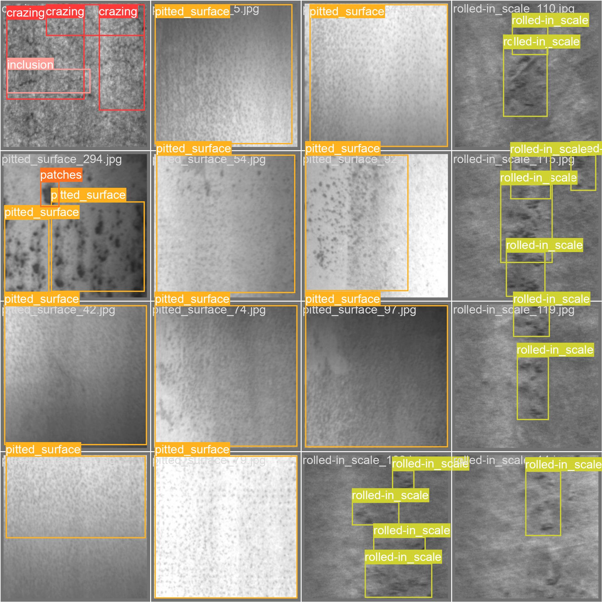
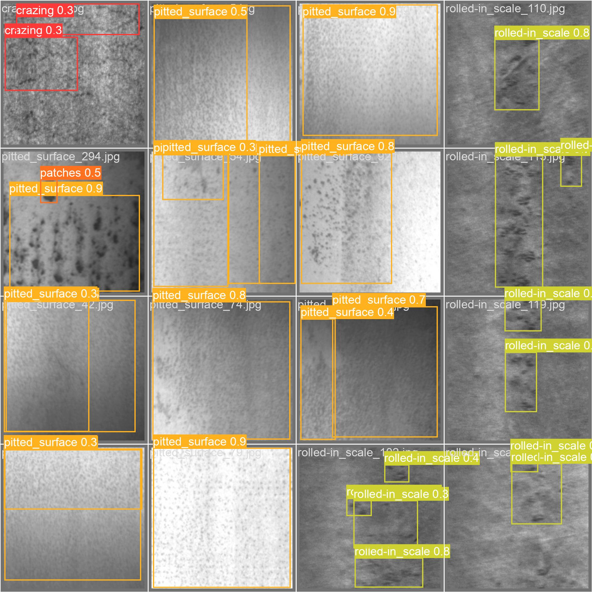

# Steel defect detection system based on improved YOLOv8 algorithm(基于改进YOLOv8算法的钢材瑕疵辅助检测系统)
Traditional steel defect detection mainly relies on manual visual inspection or the use of simple machine vision systems, but these methods have problems such as low efficiency, low accuracy, high labor intensity, and susceptibility to human factors. So I independently developed a steel defect auxiliary detection system based on the improved YOLOv8 algorithm.
## Methonds
The project proposed an improved YOLOv8 algorithm. First, a residual attention mechanism was proposed, namely the CBAM attention mechanism ResCBAM with residual connection, and added to the head of the YOLOv8 model to improve the model's ability to extract features while preventing the model from overfitting. GhostConv is used to replace the ordinary convolution in the backbone to make the model more lightweight while ensuring performance. At the same time, the WIOU loss function is introduced to replace the original CIOU loss function to avoid the problem of small targets having too much influence on the loss function and alleviate the problem of imbalanced data sets. The experimental results show that compared with the original YOLOv8 model, the proposed improved YOLOv8 model has improved Precision, F1score, and mAP50 by 5.6%, 3.1%, and 1.5% on the public NEU-DET dataset, respectively. The mAP50 is 79.2%, reaching the state-of-the-art (SOTA) level, significantly improving the detection accuracy and efficiency, which is of great significance for ensuring product quality and reducing detection costs. The model is also deployed on the WEB side, and users can access the web page to upload pictures or take photos for detection, and can save the results.

Project deployment website: https://huggingface.co/spaces/llzzyy233/Defect_detection

## Architecture
<p align="center">
   
</p>

## Table : Comparisons with other detection models on the NEU-DET dataset models
|     Model     | Test Size |  Param.   |   FLOPs   | mAP<sub>50</sub><sup>val</sup> | mAP<sub>50-95</sub><sup>val</sup> |
| :-----------: | :-------: | :-------: | :-------: | :----------------------------: | :-------------------------------: |
|    YOLOv5s    |    640    |   7.04M   |   15.9G   |             70.87%             |              35.02%               |
|    YOLOv5m    |    640    |  20.89M   |  183.5G   |             71.74%             |              36.67%               |
|    YOLOv5l    |    640    |  46.17M   |  183.5G   |             72.23%             |              36.74%               |
|    YOLOv7     |    640    |  37.22M   |  196.2G   |             71.92%             |               37.2%               |
|    YOLOv8     |    640    |   3.01M   |   8.1G    |             77.7%              |               46.2%               |
| **Our model** |  **640**  | **4.05M** | **10.2G** |           **79.2%**            |              **47%**              |

## Figure: Comparison of accuracy before and after improvement
<p align="center">
  
</p>


## Model metrics

### PR_Curve
<p align="center">
  
</p>

### confusion__matrix_normalized
<p align="center">
  
</p>

## Results

<p align="center">
  
  
  <p align="center">label(left)-----------------------------------------------------------------pred(right) </p>
</p>

## Requirements
* Linux (Ubuntu)/Windows
* Python >= 3.8
* Pytorch >= 1.13.1
* NVIDIA GPU + CUDA CuDNN 


## Dataset
You can download the NEU-DET Dataset on this website https://pan.baidu.com/s/1K-mTgSJfhFrcVSO8MUqHbQ?pwd=6666 

I had already  divided this dataset into training, validation, and testing set (80-10-10%)  

## Quick start

```
  git clone https://github.com/LZY-233/yolov8_Imporved-Defect_detection.git
  cd yolov8_Imporved-Defect_detection
  pip install -r requirements.txt
```
Then download the dataset ,unzip it and move the relative folder into the project directory as it is represented here below

       yolov8_Imporved-Defect_detection
          ├── README.md
          ├── imgs
          ├── NEU-DET
          ├── ultralytics
          ├── train.py
          ├── requirements.txt

### Train&&Val(yolov8_ResBlock_CBAM_GhostConv)
  ```
  python train.py --model ./ultralytics/cfg/models/v8/yolov8_ResBlock_CBAM_GhostConv.yaml --data_dir NEU-DET/data.ymal
  ```

## Reference
https://github.com/ultralytics/ultralytics